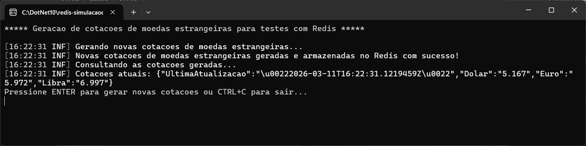
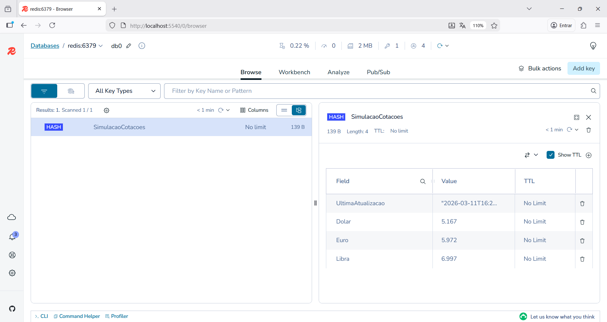
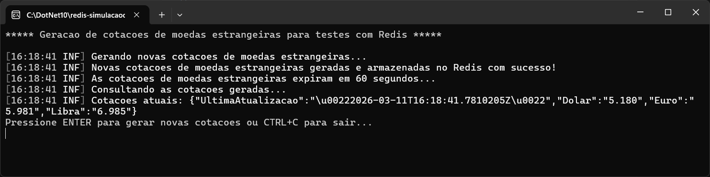

# dotnet10-consoleapp-redis_simulacaocotacoes
Exemplo em .NET 10 de Console Application para geração simulada de cotações de moedas estrangeiras (dólar, euro e libra) no Redis.

Testes sem expiração dos dados:

Testes com dados expirando:

